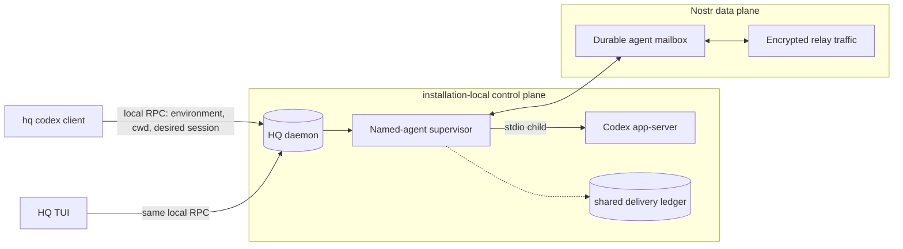

# HQ

HQ is a local message system for agents and a human. Agents send messages to the human inbox, the human replies from a terminal UI, and agents read replies or other mailbox messages later. One local HQ node owns signing, SQLite state, projections, subscriptions, and remote relay transport; commands are versioned domain clients.

The node stores messages in SQLite at `~/.local/state/hq/hq.db`, or `$XDG_STATE_HOME/hq/hq.db` when `XDG_STATE_HOME` is set. Normal commands coordinate and auto-start the node when needed. On Unix they use a protected local socket; Windows local client transport is not supported yet.

## Install

HQ needs Go 1.25 or later.

```sh
go install github.com/wbbradley/hq/cmd/hq@latest
```

From a local checkout:

```sh
go install ./cmd/hq
```

Create one installation identity before first use:

```sh
hq identity init
```

The node loads the root key from `~/.local/state/hq/hq.key` with mode `0600` and keeps the key out of SQLite. Same-user processes can still read the key, so this release assumes cooperative local actors.

## Agent use

Install the HQ agent skill with GitHub CLI:

```sh
gh skill install wbbradley/hq hq@main --agent codex --scope user
```

The `@main` pin installs the current skill before the next tagged HQ release. After a release includes the skill, `hq@main` can be shortened to `hq`.

Run `hq agents` to print the short agent workflow:

```sh
hq agents
```

HQ embeds [the agent instruction source](internal/agenthelp/instructions.md) in the binary. Focused topics keep rare details out of the default agent context:

```sh
hq agents commands
hq agents sync-semantics
hq agents delivery-semantics
```

HQ detects `CODEX_THREAD_ID`, `CLAUDE_CODE_SESSION_ID`, or `PI_SESSION_ID` and binds one private mailbox to that namespaced harness session. Agents do not need to manage a session ID. HQ stops with an error if more than one built-in harness ID is present because silent routing could select the wrong mailbox.

```sh
reply=$(hq ask "Which API name should I use?")

# Send asynchronously, then optionally wait for its reply later.
message_id=$(hq send "Review the completed migration when convenient.")
later_reply=$(hq wait "$message_id")

# Read replies and unsolicited messages in this agent mailbox.
hq poll
```

`ask` is request-response by default: it waits without a timeout until the human replies. Use `send` when no reply is needed immediately or useful work can continue asynchronously. `wait` also waits indefinitely by default; add `--timeout` only for a real deadline, not as a routine polling bound.

`poll` exits with code 3 and writes nothing when the mailbox has no ready messages.

The mailbox follows a resumed harness session across process restarts and directory changes. `--session ID` and `HQ_SESSION` select a `custom` mailbox for advanced use; an explicit flag wins. `hq mailboxes` lists mailbox candidates seen in the current directory, Git common directory, worktree, branch, or compact remote identity. Each row includes `agent=NAME` when the mailbox has a durable agent name, `agent=NAME (retired)` when that agent is retired, or `agent=-` when it is unnamed. JSON output includes `agent_name` for named mailboxes and `agent_retired` when applicable. The command does not claim or merge a mailbox.

Durable installation-local agent names can be created or can adopt an existing unnamed local agent mailbox. Names are lowercase slugs and remain permanently reserved after retirement. Presence is a local advisory lease rather than a relay heartbeat:

```sh
hq agent create fred
hq agent create jane --mailbox MAILBOX_ID
hq agent list --json
hq agent retire fred --yes
```

## Codex app-server bridge

`hq codex` is a local control client for a daemon-owned, durable named agent. It requires an installed and authenticated Codex CLI **v0.148.0** on the caller's `PATH` and an initialized HQ identity:



```sh
codex --version
hq identity init
```

Launch or resume a named agent in the current directory, optionally with an initial prompt:

```sh
hq codex --agent fred
hq codex --agent fred --cwd . "Inspect the failing tests and propose a fix"
hq codex --agent fred --new-thread
hq codex --agent fred --session 019c0000-0000-7000-8000-000000000001
```

`--agent NAME` is required; anonymous bridges and the old top-level `--resume` form are unsupported and no anonymous bridge state is migrated. `--cwd` defaults to the invoking client's current directory, and relative values are resolved there before the request is sent. The daemon validates the absolute path on its own machine, starts or resumes the exact requested thread, and changes the durable selection only after Codex acknowledges success. A missing rollout is an actionable failure and never silently creates a replacement.

The client transmits its complete environment snapshot as a sensitive, transient local-RPC input so the child sees the caller's credentials, `PATH`, and Codex configuration. The environment is used only to construct the child process: it is never stored in SQLite, signed events, mutation receipts, the ledger, Nostr, logs, diagnostics, status, or RPC results. `--yolo` starts `codex --yolo app-server --stdio`; use it only when the surrounding environment provides the required isolation.

The CLI waits for a definitive running or failed acknowledgement, prints the agent, selected thread, directory, and status, and exits. The bridge and app-server remain children of the daemon; they survive CLI or TUI exit and stop cleanly when the daemon stops or restarts. Workers are not automatically restarted after a node restart, so the agent is offline while retaining its selection.

A newly created agent has no selected session until its first successful `thread/start`. New threads receive developer instructions naming the durable agent and requiring structured human input; exact resumes do not replace the thread's instructions. Starting another thread preserves historical bindings and their exact repository/directory context, creation time, and most-recent selection time. One thread can never be reassigned to another agent.

Press `g` in the TUI to search non-retired agents, inspect active/offline state and current and historical sessions, resume an exact thread, start a new thread with a directory input, or stop a local worker. Switching a live worker requires confirmation and all operations run asynchronously without discarding inbox position, focus, or drafts.

Named bridges hold a local 30-second ownership lease renewed every 10 seconds as the final exclusion boundary. A conflicting independently owned lease is reported rather than killed. Repeated local launch request IDs are idempotent, different named agents may run concurrently, and one daemon-shared ledger serializes their delivery checkpoints.

The CLI/TUI acknowledgement includes the agent, Codex thread, directory, and runtime phase without creating a mailbox status event or Nostr outbox row. Open `hq` and send a root message to the durable agent. Replies remain bound to the thread they answer and are not treated as ordinary input for a replacement thread. The bridge starts a turn while idle and steers the active turn when Codex permits it.

Structured questions and approvals appear as separate HQ inbox rows with Codex thread, turn, item, request, and HQ message IDs. Reply with exactly one choice shown in the details. Choices such as `acceptForSession`, `grantSession`, or a policy-amendment choice persist more authority than a one-time approval and are labeled `PERSISTS`. Permission denial and cancellation always return an empty turn-scoped profile. MCP form accepts require `accept {"field":"value"}` with a validated primitive JSON object; URL requests use `accept`, `decline`, or `cancel`.

HQ persists message bodies. A Codex input field marked secret is therefore rejected before its label, question, options, or answer can be stored; the inbox receives only a generic diagnostic. Use Codex directly when a workflow genuinely requires non-persistent secret entry.

Only final `item/completed` agent-message content is relayed. Streaming deltas, reasoning, raw events, command output, and tool progress stay out of HQ. Failed or interrupted turns get one concise status after any completed output.

### Restart and delivery boundary

The bridge stores delivery and emitted-output checkpoints beside the resolved HQ database as `<database>.codexbridge.json` with owner-only permissions. Accepted HQ messages carry their HQ ID as Codex `clientUserMessageId`; an uncertain send is reconciled against Codex thread history before retry. Canonical output uses deterministic HQ IDs and reconciles the HQ store before marking its ledger checkpoint, so replay after a normal restart does not duplicate it.

This is an exactly-once recovery boundary for daemon-owned workers, not a distributed lock. HQ claims expire after 30 seconds and Codex steering errors are not a stable typed API in v0.148.0.

On cancellation, EOF, child failure, or a fatal output error, the bridge stops accepting input, releases uncommitted claims, cancels pending structured waits, drains accepted canonical output, emits one terminal HQ status when the store remains available, then closes or kills the child.

Troubleshooting:

- Run `hq help codex` to confirm syntax and `codex --version` to confirm v0.148.0.
- An unsupported server request stops the bridge with compatibility guidance instead of guessing a permissive response.
- If readiness fails, verify Codex authentication, the caller environment, the working directory, and HQ identity; sensitive child environment and raw child stderr are deliberately absent from diagnostics.
- If an immediate relay sync request is undesirable, use global `--no-sync`; local HQ and Codex delivery still operate, but a network-enabled node may still publish durable outbox work.
- Do not delete the sidecar ledger while a bridge is running.

The opt-in smoke test checks the installed v0.148.0 executable and official initialize/initialized handshake without starting a turn or consuming model quota:

```sh
HQ_CODEX_SMOKE=1 go test ./internal/codexbridge -run '^TestInstalledCodexV01480Smoke$' -count=1 -v
```

The bridge protocol follows the official [Codex app-server documentation](https://learn.chatgpt.com/docs/app-server).

## Human use

Run `hq` in a terminal to open the mailbox UI:

```sh
hq
```

The default view shows open messages in the reserved `human` mailbox. Use these keys:

- `j` / `k`: move
- Tab / Shift+Tab: move focus among Inbox, Message, and Reply
- Page Up / Page Down: page the focused pane
- Enter: reply to the selected open Codex turn; Enter again submits
- `d`: archive all visible messages in the selected turn without replying
- `u`: undo the most recent archive action
- `n`: choose a local named agent (or `self`) and write a new root message independently of the selected row
- Shift+Enter / Ctrl+J: add a line break while editing
- `s`: toggle sent messages
- `x`: toggle archived inbox messages
- `v`: toggle relay and event status
- `i`: toggle technical message IDs and Codex correlation details
- `r`: refresh
- `q`: quit

Sent and Archived are independent filters. This lets the human view the open inbox, add sent messages, add archived messages, or show all three sets together. Messages carrying the same Codex thread and turn correlation are coalesced into one incoming row, including the final answer. The selected turn's detail pane shows every part chronologically beneath a timestamp divider and updates live as new parts arrive, without disturbing an active draft. Replies retain the Codex thread and turn correlation, remain bound to the turn's reply target, and archive every archiveable message currently shown for that turn.

The `n` picker is searchable and lists `self` plus non-retired named agents from this HQ installation, with advisory active/offline and last-active state. Offline agents remain selectable and receive durable queued root messages; selecting `self` creates a durable note in the human inbox. New-message drafts do not archive or inherit reply correlation from the selected turn. Remote agent discovery and qualified addresses such as `fred@laptop` are future work and are not inferred from relay presence.

The TUI always fits its terminal viewport. The full-width inbox is a fixed, selection-scrolling pane occupying 25% of terminal height. The full-width message and reply panes are always stacked beneath it. The reply pane uses 15% of terminal height with a six-line minimum, including its border, and the message pane receives the remaining space. Tab and Shift+Tab move focus among the three panes; leaving an active composer stows it as a resumable draft, returns inbox navigation to normal, marks reply drafts on their thread, and gives new-message drafts their own outbound inbox row. Unfocused outlines use a subdued frame while the active pane uses a brighter purple. Page Up, Page Down, and `j`/`k` act on the focused pane; the reply textarea manages its own cursor and scrolling while focused.

Incoming rows begin directly with a friendly sender label such as `codex · hq`. Detail panels combine the message kind and sender in the upper border, for example `[an update from codex · hq]` or `[a final answer from codex · hq]`. Each message body is rendered as terminal Markdown, including emphasis, headings, lists, links, code, and width-aware GFM tables; timestamp dividers and technical metadata remain literal TUI content. The source device, repository path, git branch, compact remotes, asynchronously loaded open pull request, and opaque message identifiers stay hidden until technical details are expanded with `i`; the collapsed-state hint is right-aligned in the panel's lower border. Codex final answers retain their green treatment, while progress updates, statuses, and one-shot notices use the normal body color.

When stdin or stdout is not a terminal, bare `hq` lists open messages in the human mailbox for the current work directory.

Human commands also work without the TUI:

```sh
hq list --recipient human
hq answer MESSAGE_ID "Use ListWidgets"
hq cancel MESSAGE_ID
```

### Pair another installation

Each machine keeps its own installation ID, root key, SQLite database, and local node. A signed device grant can place both installations in one logical human account without sharing those files or identities.

On the machine being added, get its identity:

```sh
hq identity show
```

Configure the same retained relay on both machines first. On the account creator, make the invite. `--relay` records the added machine's relay hint; the bundle also signs up to three relay hints from the creator's relay config. Redirect stdout to retain the exact signed bundle.

```sh
hq human invite --name desktop --relay ws://relay.lan:7447 INSTALLATION_ID NPUB > desktop.hq-invite.json
```

Copy the file to the added machine, then join:

```sh
hq human join desktop.hq-invite.json
hq human show
hq human devices
```

Both installations must use the same retained relay for network delivery. The account creator may run `hq human revoke INSTALLATION_ID`. Device names are signed display text; hostnames, relay URLs, IP addresses, and ports never prove identity.

The creator installation is the only account administrator in this release. Back up its identity with `hq identity export`. Admin transfer and creator-key rotation are deferred. Agent questions now fan to every active account device. Either machine can show the aggregate inbox and answer an agent on the source machine. The TUI shows the source device and installation for each account message.

See [docs/lan.md](docs/lan.md) for the supported retained-relay setup, systemd and launchd examples, an automated smoke test, and a manual two-machine checklist.

## Command summary

```text
hq ask [--session ID] [--dir PATH] [--details TEXT] [--timeout DURATION] [--interval DURATION] [--json] [MESSAGE]
hq send [--session ID] [--dir PATH] [--details TEXT] [--json] [MESSAGE]
hq wait [--session ID] [--dir PATH] [--timeout DURATION] [--interval DURATION] [--json] MESSAGE_ID
hq poll [--session ID] [--dir PATH] [--json]
hq get MESSAGE_ID
hq list [--sender MAILBOX] [--recipient MAILBOX] [--dir PATH] [--archived|--all] [--limit N] [--json]
hq mailboxes [--dir PATH] [--json]
hq agent create NAME [--mailbox MAILBOX_ID]
hq agent list [--json]
hq agent retire NAME --yes
hq identity init
hq identity show [--json]
hq identity export BACKUP_PATH
hq identity import BACKUP_PATH
hq identity reset --yes
hq human show [--json]
hq human invite [--name NAME] [--relay URL] INSTALLATION_ID NPUB
hq human join FILE
hq human devices [--json]
hq human revoke INSTALLATION_ID
hq peer add [--name NAME] [--relay URL] INSTALLATION_ID NPUB
hq peer list [--json]
hq peer distrust INSTALLATION_ID
hq mailbox share MAILBOX_ID PEER_INSTALLATION_ID
hq mailbox revoke MAILBOX_ID PEER_INSTALLATION_ID
hq relay add [--read=BOOL] [--write=BOOL] [--unsafe-no-auth] WSS_URL
hq relay list [--json]
hq relay remove WSS_URL
hq status [--json]
hq sync
hq daemon run|status|stop|restart
hq answer MESSAGE_ID [RESPONSE]
hq cancel MESSAGE_ID
hq codex --agent NAME [--cwd PATH] [--new-thread | --session THREAD_ID] [--yolo] [INITIAL PROMPT...]
hq tui
hq agents [commands|sync-semantics|delivery-semantics]
```

Set `HQ_DB` or pass global `--db PATH` before the command to use another database. Mutating commands ask the node to commit their signed event and may wait up to three seconds for an immediate relay synchronization request. `--no-sync` skips only that client request; it is not a node-wide offline switch. Relay errors go to stderr and never undo the local event.

The local node is required and normally auto-starts on the first client connection. `hq daemon run` runs it in the foreground; systemd or launchd may keep it warm for uninterrupted relay subscriptions. `hq daemon status` reads the protected lifecycle RPC, `stop` requests a clean stop, and `restart` replaces the in-process runtime while connected clients reconnect and resubscribe. Because `restart` does not reload the daemon executable, after installing a new HQ build use `hq daemon stop`, wait for it to exit, and let the next normal command auto-start the new binary. `hq sync` asks the owning node to wake its network engine. Build drift is allowed when wire ranges remain compatible and is shown with restart guidance; incompatible ranges identify the stale side.

## Message and delivery rules

Each mailbox has one opaque ID. An agent mailbox has a unique `(harness, external session ID)` binding. Each installation has a reserved human mailbox projection, while the human account is the shared audience. Signed message and mailbox-context events carry directory and Git data; those fields aid display and abandoned-mailbox search but do not grant mailbox access. Replying adds signed answer and archive events in one SQLite transaction and fans both facts to active account devices.

`ask` and `wait` read a reply only when the current mailbox sent the first message. `poll` reads every ready message addressed to the current harness mailbox, including unsolicited human messages, without a directory filter. `get` keeps direct-ID access as an explicit path for cooperative cross-mailbox inspection. Delivery leases each row, writes stdout once, and then sets `completed_at` and `archived_at`. A crash after stdout but before the database update can cause one later retry, so consumers can use the message ID as an idempotency key.

`hq list` shows only open messages by default. `--archived` shows archived messages, and `--all` shows both.

The TUI subscribes before its initial snapshot and reloads immediately after local or remote commits. A five-minute repair refresh remains; active text, focus, and selection survive every reload. Sent rows show `sending`, `sent`, `peer received`, or `rejected`. Press `v` for relay health, last receive time, account members, pending account fanout, relay-accepted sends, invalid or revoked-device traffic, and event queue counts.

SQLite schema 11 includes durable named-agent session-history projections and local ownership leases in addition to mutation receipts and monotonic change revisions. Schema 7 migrates through versions 8, 9, 10, and 11; unsupported older layouts may still reset during pre-1.0 development.

See [docs/design.md](docs/design.md) for the storage contract, [docs/events.md](docs/events.md) for signed causal state, and [docs/nostr.md](docs/nostr.md) for encrypted relay transport.

## Development

```sh
go test ./...
go vet ./...
go build ./cmd/hq
```

Run `go test -count=1 -v ./e2e` for the isolated black-box CLI test. It builds the real executable,
uses temporary HOME, XDG, runtime, and database paths, exercises the auto-started node through a
complete agent-to-human request/reply exchange, and stops the node before cleanup.

Releases use GoReleaser when a `v*` tag reaches GitHub. CI tests Linux, macOS, and Windows.

## License

MIT
