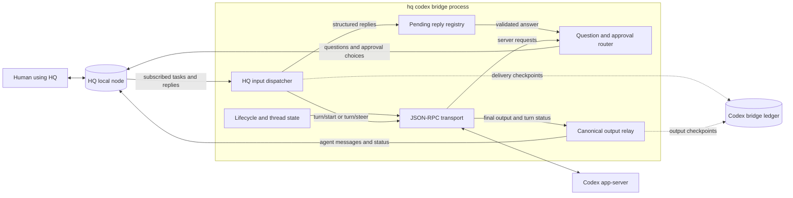

# HQ

HQ is a local message system for agents and a human. Agents send messages to the human inbox, the human replies from a terminal UI, and agents read replies or other mailbox messages later. One local HQ node owns signing, SQLite state, projections, subscriptions, and remote relay transport; commands are versioned domain clients.

The node stores messages in SQLite at `~/.local/state/hq/hq.db`, or `$XDG_STATE_HOME/hq/hq.db` when `XDG_STATE_HOME` is set. Normal commands coordinate and auto-start the node when needed. On Unix they use a protected local socket; Windows local client transport is not supported yet.

## Install

HQ needs Go 1.25 or later.

```sh
go install github.com/wbbradley/hq/cmd/hq@latest
```

From a local checkout:

```sh
go install ./cmd/hq
```

Create one installation identity before first use:

```sh
hq identity init
```

The node loads the root key from `~/.local/state/hq/hq.key` with mode `0600` and keeps the key out of SQLite. Same-user processes can still read the key, so this release assumes cooperative local actors.

## Agent use

Install the HQ agent skill with GitHub CLI:

```sh
gh skill install wbbradley/hq hq@main --agent codex --scope user
```

The `@main` pin installs the current skill before the next tagged HQ release. After a release includes the skill, `hq@main` can be shortened to `hq`.

Run `hq agents` to print the short agent workflow:

```sh
hq agents
```

HQ embeds [the agent instruction source](internal/agenthelp/instructions.md) in the binary. Focused topics keep rare details out of the default agent context:

```sh
hq agents commands
hq agents sync-semantics
hq agents delivery-semantics
```

HQ detects `CODEX_THREAD_ID`, `CLAUDE_CODE_SESSION_ID`, or `PI_SESSION_ID` and binds one private mailbox to that namespaced harness session. Agents do not need to manage a session ID. HQ stops with an error if more than one built-in harness ID is present because silent routing could select the wrong mailbox.

```sh
reply=$(hq ask "Which API name should I use?")

# Send asynchronously, then optionally wait for its reply later.
message_id=$(hq send "Review the completed migration when convenient.")
later_reply=$(hq wait "$message_id")

# Read replies and unsolicited messages in this agent mailbox.
hq poll
```

`ask` is request-response by default: it waits without a timeout until the human replies. Use `send` when no reply is needed immediately or useful work can continue asynchronously. `wait` also waits indefinitely by default; add `--timeout` only for a real deadline, not as a routine polling bound.

`poll` exits with code 3 and writes nothing when the mailbox has no ready messages.

The mailbox follows a resumed harness session across process restarts and directory changes. `--session ID` and `HQ_SESSION` select a `custom` mailbox for advanced use; an explicit flag wins. `hq mailboxes` lists mailbox candidates seen in the current directory, Git common directory, worktree, branch, or compact remote identity. The command does not claim or merge a mailbox.

## Codex app-server bridge

`hq codex` runs a Codex app-server thread as an HQ agent mailbox. It requires an installed and authenticated Codex CLI **v0.148.0** on `PATH` and an initialized HQ identity:



```sh
codex --version
hq identity init
```

Start a new thread in the current directory, optionally with an initial prompt:

```sh
hq codex
hq codex --cwd . "Inspect the failing tests and propose a fix"
```

`--cwd` defaults to the current directory; a relative path is resolved from that directory. Without an initial prompt, the bridge reports readiness and waits for HQ input. A new thread receives a narrow instruction to use structured human input whenever it needs an answer.

Resume the exact same Codex conversation without replacing its existing instructions:

```sh
hq codex --cwd /path/to/repo --resume 019c0000-0000-7000-8000-000000000001
```

The ready inbox message includes the Codex thread ID and opaque HQ mailbox ID. In another terminal, open `hq`, select a row from that mailbox, and press `n` to send new work. Replies to completed Codex output also become ordinary input. The bridge starts a turn while idle and steers the active turn when Codex permits it.

Structured questions and approvals appear as separate HQ inbox rows with Codex thread, turn, item, request, and HQ message IDs. Reply with exactly one choice shown in the details. Choices such as `acceptForSession`, `grantSession`, or a policy-amendment choice persist more authority than a one-time approval and are labeled `PERSISTS`. Permission denial and cancellation always return an empty turn-scoped profile. MCP form accepts require `accept {"field":"value"}` with a validated primitive JSON object; URL requests use `accept`, `decline`, or `cancel`.

HQ persists message bodies. A Codex input field marked secret is therefore rejected before its label, question, options, or answer can be stored; the inbox receives only a generic diagnostic. Use Codex directly when a workflow genuinely requires non-persistent secret entry.

Only final `item/completed` agent-message content is relayed. Streaming deltas, reasoning, raw events, command output, and tool progress stay out of HQ. Failed or interrupted turns get one concise status after any completed output.

### Restart and delivery boundary

The bridge stores delivery and emitted-output checkpoints beside the resolved HQ database as `<database>.codexbridge.json` with owner-only permissions. Accepted HQ messages carry their HQ ID as Codex `clientUserMessageId`; an uncertain send is reconciled against Codex thread history before retry. Canonical output uses deterministic HQ IDs and reconciles the HQ store before marking its ledger checkpoint, so replay after a normal restart does not duplicate it.

This is an exactly-once recovery boundary for one bridge process and its restarts, not a distributed lock. HQ claims expire after 30 seconds and Codex steering errors are not a stable typed API in v0.148.0. Do not run two bridge processes for the same thread: concurrent processes can race after lease expiry, so cross-process exactly-once delivery is not promised.

On cancellation, EOF, child failure, or a fatal output error, the bridge stops accepting input, releases uncommitted claims, cancels pending structured waits, drains accepted canonical output, emits one terminal HQ status when the store remains available, then closes or kills the child. App-server stderr is written separately as `hq codex: app-server: ...`; it is never parsed as protocol traffic.

Troubleshooting:

- Run `hq help codex` to confirm syntax and `codex --version` to confirm v0.148.0.
- An unsupported server request stops the bridge with compatibility guidance instead of guessing a permissive response.
- If the ready message never appears, inspect prefixed app-server stderr and the terminal error. Verify Codex authentication, the working directory, and HQ identity.
- If an immediate relay sync request is undesirable, use global `--no-sync`; local HQ and Codex delivery still operate, but a network-enabled node may still publish durable outbox work.
- Do not delete the sidecar ledger while a bridge is running.

The opt-in smoke test checks the installed v0.148.0 executable and official initialize/initialized handshake without starting a turn or consuming model quota:

```sh
HQ_CODEX_SMOKE=1 go test ./internal/codexbridge -run '^TestInstalledCodexV01480Smoke$' -count=1 -v
```

The bridge protocol follows the official [Codex app-server documentation](https://learn.chatgpt.com/docs/app-server).

## Human use

Run `hq` in a terminal to open the mailbox UI:

```sh
hq
```

The default view shows open messages in the reserved `human` mailbox. Use these keys:

- `j` / `k`: move
- Enter: reply to an open inbox message; Enter again submits
- `d`: archive the selected open inbox message without replying
- `n`: write a new message to the agent session tied to the selected row
- Shift+Enter / Ctrl+J: add a line break while editing
- `s`: toggle sent messages
- `x`: toggle archived inbox messages
- `v`: toggle relay and event status
- `i`: toggle technical message IDs and Codex correlation details
- `r`: refresh
- `q`: quit

Sent and Archived are independent filters. This lets the human view the open inbox, add sent messages, add archived messages, or show all three sets together. Agent sessions use the repository directory name in friendly labels such as `codex · hq`; opaque mailbox and message IDs stay hidden until technical details are expanded. Codex final answers are emphasized, while progress updates, statuses, and one-shot notices are quieter. Each detail panel also shows the local git branch, compact remotes, and an asynchronously loaded open pull request when `gh` credentials are available.

When stdin or stdout is not a terminal, bare `hq` lists open messages in the human mailbox for the current work directory.

Human commands also work without the TUI:

```sh
hq list --recipient human
hq answer MESSAGE_ID "Use ListWidgets"
hq cancel MESSAGE_ID
```

### Pair another installation

Each machine keeps its own installation ID, root key, SQLite database, and local node. A signed device grant can place both installations in one logical human account without sharing those files or identities.

On the machine being added, get its identity:

```sh
hq identity show
```

Configure the same retained relay on both machines first. On the account creator, make the invite. `--relay` records the added machine's relay hint; the bundle also signs up to three relay hints from the creator's relay config. Redirect stdout to retain the exact signed bundle.

```sh
hq human invite --name desktop --relay ws://relay.lan:7447 INSTALLATION_ID NPUB > desktop.hq-invite.json
```

Copy the file to the added machine, then join:

```sh
hq human join desktop.hq-invite.json
hq human show
hq human devices
```

Both installations must use the same retained relay for network delivery. The account creator may run `hq human revoke INSTALLATION_ID`. Device names are signed display text; hostnames, relay URLs, IP addresses, and ports never prove identity.

The creator installation is the only account administrator in this release. Back up its identity with `hq identity export`. Admin transfer and creator-key rotation are deferred. Agent questions now fan to every active account device. Either machine can show the aggregate inbox and answer an agent on the source machine. The TUI shows the source device and installation for each account message.

See [docs/lan.md](docs/lan.md) for the supported retained-relay setup, systemd and launchd examples, an automated smoke test, and a manual two-machine checklist.

## Command summary

```text
hq ask [--session ID] [--dir PATH] [--details TEXT] [--timeout DURATION] [--interval DURATION] [--json] [MESSAGE]
hq send [--session ID] [--dir PATH] [--details TEXT] [--json] [MESSAGE]
hq wait [--session ID] [--dir PATH] [--timeout DURATION] [--interval DURATION] [--json] MESSAGE_ID
hq poll [--session ID] [--dir PATH] [--json]
hq get MESSAGE_ID
hq list [--sender MAILBOX] [--recipient MAILBOX] [--dir PATH] [--archived|--all] [--limit N] [--json]
hq mailboxes [--dir PATH] [--json]
hq identity init
hq identity show [--json]
hq identity export BACKUP_PATH
hq identity import BACKUP_PATH
hq identity reset --yes
hq human show [--json]
hq human invite [--name NAME] [--relay URL] INSTALLATION_ID NPUB
hq human join FILE
hq human devices [--json]
hq human revoke INSTALLATION_ID
hq peer add [--name NAME] [--relay URL] INSTALLATION_ID NPUB
hq peer list [--json]
hq peer distrust INSTALLATION_ID
hq mailbox share MAILBOX_ID PEER_INSTALLATION_ID
hq mailbox revoke MAILBOX_ID PEER_INSTALLATION_ID
hq relay add [--read=BOOL] [--write=BOOL] [--unsafe-no-auth] WSS_URL
hq relay list [--json]
hq relay remove WSS_URL
hq status [--json]
hq sync
hq daemon run|status|stop|restart
hq answer MESSAGE_ID [RESPONSE]
hq cancel MESSAGE_ID
hq codex [--cwd PATH] [--resume THREAD_ID] [INITIAL PROMPT...]
hq tui
hq agents [commands|sync-semantics|delivery-semantics]
```

Set `HQ_DB` or pass global `--db PATH` before the command to use another database. Mutating commands ask the node to commit their signed event and may wait up to three seconds for an immediate relay synchronization request. `--no-sync` skips only that client request; it is not a node-wide offline switch. Relay errors go to stderr and never undo the local event.

The local node is required and normally auto-starts on the first client connection. `hq daemon run` runs it in the foreground; systemd or launchd may keep it warm for uninterrupted relay subscriptions. `hq daemon status` reads the protected lifecycle RPC, `stop` requests a clean stop, and `restart` replaces the instance while connected clients reconnect and resubscribe. `hq sync` asks the owning node to wake its network engine. Build drift is allowed when wire ranges remain compatible and is shown with restart guidance; incompatible ranges identify the stale side.

## Message and delivery rules

Each mailbox has one opaque ID. An agent mailbox has a unique `(harness, external session ID)` binding. Each installation has a reserved human mailbox projection, while the human account is the shared audience. Signed message and mailbox-context events carry directory and Git data; those fields aid display and abandoned-mailbox search but do not grant mailbox access. Replying adds signed answer and archive events in one SQLite transaction and fans both facts to active account devices.

`ask` and `wait` read a reply only when the current mailbox sent the first message. `poll` reads every ready message addressed to the current harness mailbox, including unsolicited human messages, without a directory filter. `get` keeps direct-ID access as an explicit path for cooperative cross-mailbox inspection. Delivery leases each row, writes stdout once, and then sets `completed_at` and `archived_at`. A crash after stdout but before the database update can cause one later retry, so consumers can use the message ID as an idempotency key.

`hq list` shows only open messages by default. `--archived` shows archived messages, and `--all` shows both.

The TUI subscribes before its initial snapshot and reloads immediately after local or remote commits. A five-minute repair refresh remains; active text, focus, and selection survive every reload. Sent rows show `sending`, `sent`, `peer received`, or `rejected`. Press `v` for relay health, last receive time, account members, pending account fanout, relay-accepted sends, invalid or revoked-device traffic, and event queue counts.

SQLite schema 9 includes durable mutation receipts and monotonic change revisions. Schema 7 migrates through versions 8 and 9; unsupported older layouts may still reset during pre-1.0 development.

See [docs/design.md](docs/design.md) for the storage contract, [docs/events.md](docs/events.md) for signed causal state, and [docs/nostr.md](docs/nostr.md) for encrypted relay transport.

## Development

```sh
go test ./...
go vet ./...
go build ./cmd/hq
```

Run `go test -count=1 -v ./e2e` for the isolated black-box CLI test. It builds the real executable,
uses temporary HOME, XDG, runtime, and database paths, exercises the auto-started node through a
complete agent-to-human request/reply exchange, and stops the node before cleanup.

Releases use GoReleaser when a `v*` tag reaches GitHub. CI tests Linux, macOS, and Windows.

## License

MIT
