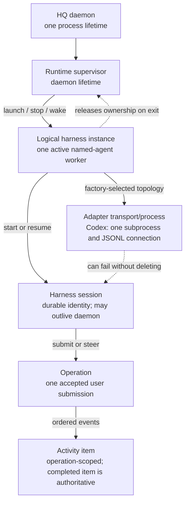

# Harness runtime contract

This document characterizes the Codex app-server behavior preserved behind HQ's harness-neutral port. It is an adapter compatibility contract, not a proposal to expose Codex vocabulary or JSON-RPC types to generic packages.

The executable vendor baseline is Codex CLI `0.149.0`. The checked-in schema bundles in `internal/codexbridge/testdata/schema/v0.149.0` were produced by the installed binary with:

```text
codex app-server generate-json-schema --experimental --out <directory>
```

The JSON-RPC fixtures under `internal/codexbridge/testdata/v0.149.0` are versioned wire captures. Older fixture directories are historical compatibility evidence, not the baseline for new behavior. The rolling [official app-server documentation](https://developers.openai.com/codex/app-server) is supporting context; it does not override the pinned schema, fixtures, or characterization tests.

## Ownership and factory inputs

`internal/harnesssupervisor` owns logical workers and resolves a registered `harness.Factory`; `internal/codexbridge.HarnessFactory` is one adapter implementation. The neutral launch boundary receives the following information without depending on Codex types:

- durable named-agent identity and optional project binding;
- requested new or resumed session identity;
- working directory and repository context;
- optional initial input and provider-specific configuration (`codex.yolo` today);
- a copied environment snapshot, stderr/log destination, durable store, delivery ledger, change subscription, and cancellation context;
- readiness and project-activation callbacks.

There is one logical instance per active named-agent worker. The current Codex topology is also one `codex app-server --stdio` subprocess per logical instance. That physical topology is an adapter choice, not a generic invariant.

The supervisor copies the caller's environment before constructing the starter. `ExecStarter` gives the child either that exact snapshot or, only when no explicit snapshot was requested, a fresh `os.Environ()` value. It never logs values. It clears the source slice after `Start`, clears `exec.Cmd.Env` after the child receives it, and the supervisor clears its transient copies. The daemon may retain one copied last-known-good launch template for automatic wake; replacement and shutdown overwrite and release that copy. A future factory must preserve these copy, clear, and no-diagnostic-value guarantees.

The adapter owns executable selection (`codex` by default), arguments, cwd, stdio pipes, stderr forwarding, JSONL framing, the 4 MiB frame limit, process wait, and kill. None of those details belong in the neutral contract.

### Adding another provider

A production provider is added at the composition boundary, without changing generic delivery or supervisor algorithms:

1. Implement `harness.Factory`, `harness.Instance`, and `harness.Session` in an adapter package. Keep its transport, process or remote-client topology, wire payloads, credentials, and provider diagnostics private to that package.
2. Declare accurate capabilities and provide either idempotent stable-ID submission or stable-ID lookup/reconciliation. Registry validation and the conformance suite reject unsafe recovery contracts.
3. Register the factory in `internal/node`, decode only that provider's opaque launch options there, and supply its display terminology. A provider may share an underlying connection while returning independently managed logical instances.
4. Add provider-specific configuration and UI controls only where needed. Common launch requests carry the explicit provider ID and opaque `provider_options`; provider concepts such as Codex YOLO never enter the neutral contract.
5. Run the reusable conformance suite and the supervisor integration/isolation tests, including new and resumed sessions, uncertain delivery, interactive requests, output, crash isolation, and teardown.

Architecture tests prevent `internal/harness`, `internal/harnessbridge`, `internal/harnesssupervisor`, domain, store, local RPC/client, CLI, and TUI production code from importing a Codex adapter or protocol package. `internal/node` is the intentional composition root where adapter registration is allowed.

## Lifetime and state model



The durable session selection is separate from runtime presence. A session is selected only after the app-server handshake and `thread/start` or `thread/resume` return a non-empty, matching thread ID, and after any project binding succeeds. A failed or mismatched resume never silently creates or selects a replacement. Explicit rotation is required.

An operation begins when `turn/start` accepts a new turn or `turn/steer` accepts input for the active turn. `turn/started` and `turn/completed` update the adapter's active-operation view. A completed `item/completed` notification is authoritative for an output item; deltas and reasoning are not persisted as messages.

## Connection and session lifecycle

Each connection performs exactly one handshake in this order:

1. send `initialize` with HQ client metadata and `capabilities.experimentalApi: true`;
2. wait for a successful response;
3. send the `initialized` notification;
4. call either `thread/start` or `thread/resume`;
5. validate and bind the returned thread ID;
6. select the durable session and signal readiness.

No thread or turn request may precede the initialization acknowledgement. New sessions receive the named-agent developer instructions. Resumed sessions do not replace developer instructions. With Codex YOLO enabled, both new and resumed requests explicitly set approval policy `never` and sandbox `danger-full-access`.

The initial prompt, when present, is submitted only after readiness state has been bound and uses a newly generated stable `clientUserMessageId`. Mailbox dispatch starts after that initial request succeeds.

## Submission delivery and recovery

The HQ message ID is the stable submission ID and is sent as Codex `clientUserMessageId` for both `turn/start` and `turn/steer`. The delivery ledger transitions as follows:

```text
absent -> pending -> uncertain -> accepted
                         |           |
                         |           +-> complete the HQ claim
                         +-> thread/read(includeTurns=true)
                              | found matching userMessage.clientId -> accepted
                              | not found -> retry with the same stable ID
```

`uncertain` is persisted before the wire call. Therefore cancellation, a write error, transport loss, or a response-loss window cannot justify immediate retry. Recovery first calls `thread/read` and searches user-message `clientId` fields; Codex item IDs are not submission IDs. A found ID completes the claim without another submission. A missing ID permits a retry with the same ID. A mismatched `thread/read` response fails closed.

If no operation is active, delivery uses `turn/start`. If one is active, it first uses `turn/steer` with `expectedTurnId`. On a non-steerable result or an active-turn race, HQ reads authoritative thread history. It accepts an already-present stable ID, retargets a changed active operation, starts a new operation if the prior one completed, or waits for an operation-state notification before retrying. Unknown steering errors fail closed after reconciliation instead of being classified as safe by default.

The generic contract must preserve the three externally meaningful canceled-call outcomes: rejected (known not accepted), accepted, and uncertain. A production harness must offer stable-ID idempotency or lookup/reconciliation. Registration must reject a harness that offers neither.

## Events, interactive requests, and ordering

The transport reads frames serially. Response correlation and notification observation therefore
follow wire order. Notification handlers run synchronously in registration order: active-operation
state first, then normalized event extraction. Each supported event becomes one indivisible work
item in a bounded 64-item FIFO/coalescing buffer. If it contains canonical output, output persists
before activity; successive work items retain source order. The relay assigns canonical time before
enqueue or coalescing, so persistence delay and receiver clocks cannot reorder output and activity.
Server-initiated requests run concurrently so a human wait cannot block response and notification
reads; their responses may complete in a different order from request arrival.

Assistant output, failed/interrupted output, terminal operation state, and completed
command/file/tool activity are durable work. A full buffer applies cancellation-aware backpressure
until they are accepted; accepted durable work is never dropped. Running operation state, plan,
diff, and progress are replaceable snapshots. A newer pending value for the same full logical key
removes the older value and moves to the tail, preserving order relative to intervening durable
work. A new key at capacity also backpressures. Capacity bounds pending work, excluding the item
currently being persisted; raw reasoning, model payloads, token deltas, spinners, and unsupported
provider noise normalize to no work and never enter the buffer.

Every supported blocking request receives exactly one JSON-RPC response. Structured questions are
correlated by agent, provider session, operation, item, and request ID. The supervisor retains a
bounded request only while at least one explicitly registered responder is active. Arrival without
a responder, loss of the last responder, provider EOF, agent stop, and shutdown immediately send
the adapter's fail-closed cancellation or denial in source order. Secret-input requests are
rejected without retaining their prompt fields. Pending prompts remain memory-only; body-free
`operations` invalidations wake clients to query their replacement view.

Unknown additive notifications are non-fatal and are ignored by handlers that do not recognize them. Malformed payloads for recognized notifications are also ignored by the relevant projection; malformed JSON-RPC envelopes remain fatal. Unsupported blocking server requests receive `-32601` and terminate the transport with a compatibility error because guessing a response could grant authority.

### Canonical message semantics

Every new harness-authored mailbox message uses canonical text schema 3. The neutral correlation is
the provider ID and session ID plus, when available, operation, item, and interactive-request IDs.
These values stay opaque outside the adapter: generic code neither assumes Codex vocabulary nor
reconstructs identity from message prose. Replies copy the typed correlation of the message they
answer, so request targeting and conversation/action grouping do not serialize and reparse labels.

Output messages use typed `update` or `final-answer` presentation and the
`hq.harness.output` technical namespace for diagnostic phase or terminal status. Runtime lifecycle
notices use typed `status` presentation and `hq.harness.status`. Interactive questions carry typed
request correlation when the full provider/session/operation identity is available; the
`hq.harness.request` section is diagnostic disclosure, including compatibility cases where a
provider request cannot form a valid full correlation.

The message body remains the primary user-facing output. `Details` contains only human-readable
errors, validation guidance, choices, schemas, and explanations. It is never parsed for
presentation or correlation. Technical sections are ordered display metadata hidden by default in
the TUI, not routing input or secret storage. Output reconciliation compares the complete typed
presentation, correlation, and ordered technical sections so a stable output ID cannot silently
collide with different content.

### Canonical activity stream

Normalized operation status, plan, diff, completed command, completed file change, completed tool
call, web search, and progress records become FCT-022 `HarnessActivityRecorded` facts. They use the same signing,
canonical log, active-human-account audience, membership parents, per-device encrypted outbox,
inbound authorization, replay, and rebuild path as account messages. They remain a separate
non-message stream: an activity is not a mutation receipt, inbox row, unread unit, delivery claim,
reply/archive/draft target, action unit, or final-answer candidate.

Canonical source identity is the originating installation and agent mailbox. Provider/session/
operation/item values remain opaque correlation. Projection keys include both identities, so equal
provider session IDs from different providers or source mailboxes cannot merge. Operation, plan,
and diff snapshots are latest-wins; repeated item/progress keys coalesce deterministically; terminal
operation and completed item records remain logical history. Completed items retain a closed
provider-neutral presentation: command source, aggregated output and exit code; bounded file
path/diff records; server/tool or tool-family name; or web query. Adapter-only arguments, results,
process IDs, web results, and other provider payload are excluded. Every string and collection is
bounded independently at a UTF-8 boundary with explicit truncation evidence.

The canonical log retains superseded activity. The disposable SQLite projection retains only
selected winners and the newest 200 progress records per source/provider session; a rebuild
reproduces that projection. Ordinary conversation pages retain canonical durable order but do not
emit replaceable progress or running-turn facts as history. The initial indexed page adds one
derived live tail: the latest useful progress for a fully correlated running operation, or the
running-turn fallback. Terminal evidence removes that tail and remains once in history.
Project-attributed activity joins the exact project/thread exchange captured by its dispatch, while
direct activity remains provider-session grouped.

The TUI keeps activity compact and non-actionable. Typed command previews disclose at most three
terminal-safe output lines plus status and omission cues; full bounded detail is available through
the inspector. Visible rows disclose failed states and truncation. Activity
never creates or selects an inbox row and does not affect open/unread counts, replies,
archive/restore, drafts, action-unit grouping, final-answer styling, or delivery. Manual scrolling
anchors only to logical message IDs across coalescing, rebuild reordering, and resize.

## Failure, cancellation, and shutdown

Protocol EOF, malformed JSON, an invalid JSON-RPC version, an oversized frame, a read/write failure, or an unsupported server request stops the transport and fails pending calls. Child-process failure is reported separately from ordinary EOF. When process and transport completion race, HQ briefly prefers an already available process result after transport closure and allows the transport reader to observe closure after process exit. The adapter refactor must retain deterministic typed causes for both orders.

Canceling an individual RPC wait removes its response slot but does not poison the connection; a
late response is ignored. For a submission, the durable `uncertain` checkpoint still requires
reconciliation. Bridge intake cancellation unblocks any enqueue waiting for buffer capacity.
Activity persistence uses a relay-owned context rather than the request/worker context, so ordinary
provider shutdown closes intake and drains every accepted durable item plus the latest accepted
coalesced value. Explicit interruption uses the optional neutral capability, which the Codex
adapter maps to `turn/interrupt`.

An item containing output and activity is not one SQLite transaction. Stable output IDs and the
delivery ledger reconcile output first if activity persistence fails after output commits; retry
then appends the deterministic activity without duplicating the message. Teardown stops new
blocking requests and waits for in-flight handlers, shuts down the provider so its event stream
closes, drains the persistence buffer, closes app-server stdin, and waits up to two seconds for
graceful process exit. A drain timeout cancels persistence and surfaces relay failure rather than
hanging silently. The child is then killed if necessary and `Wait` completes. Supervisor shutdown
cancels every logical worker and waits for all worker lifetimes. Stopping one worker releases only
that named agent's ownership and does not mutate another worker's runtime state.

Before persisting a normalized event, the neutral supervisor looks up the unique retained delivery
for the exact agent and operation and verifies its provider and session. A complete project-bound
delivery is passed intact to canonical persistence: output becomes `ProjectOutputRecorded`, while
activity remains FCT-022 with optional project/dispatch/assignment/thread provenance. No matching
delivery retains the direct-agent behavior. Ambiguous delivery identity, mismatched runtime
identity, or a migrated matching row whose project provenance is absent fails closed.

## Codex 0.149.0 protocol boundary

HQ writes these methods:

| Method | Current use | Failure policy |
| --- | --- | --- |
| `initialize` | One-time connection handshake with experimental API opt-in | Fatal |
| `initialized` | Handshake acknowledgement notification | Fatal on write |
| `thread/start` | Create an explicitly new durable session | Fatal; never select an empty result |
| `thread/resume` | Resume the requested durable session | Fatal; returned ID must match |
| `thread/read` | Reconcile submissions and active-operation races | Fatal; returned ID must match |
| `turn/start` | Submit to an idle session | Delivery remains uncertain until reconciled if acceptance is unknown |
| `turn/steer` | Submit to the expected active operation | Reconcile before retargeting or retrying |

`turn/interrupt` implements the neutral optional interruption capability. Codex also advertises plans, diffs, tool lifecycle, and bounded streaming activity through its normalized adapter capabilities.

HQ handles these server requests:

| Method | Behavior |
| --- | --- |
| `item/tool/requestUserInput` | Publish typed non-secret questions and return validated answers |
| `item/commandExecution/requestApproval` | Return one exact approval decision or fail closed |
| `item/fileChange/requestApproval` | Return one exact file decision or fail closed |
| `item/permissions/requestApproval` | Return requested permissions only for an explicit grant and scope |
| `mcpServer/elicitation/request` | Validate supported form or URL modes; otherwise cancel |

Every other server-request method in the generated schema is unsupported and fatal. In particular, HQ does not provide dynamic tools, authentication refresh, attestation, current-time lookup, or legacy approval request handlers.

HQ consumes these notifications and item variants:

| Notification or item | Current use |
| --- | --- |
| `turn/started` | Set the active operation and coalesce a canonical running-status activity after matching the bound session |
| `turn/completed` | Clear the matching active operation and coalesce completed, failed, or interrupted canonical activity; failed/interrupted states also retain their canonical status message |
| `turn/plan/updated` | Render typed plan steps into the coalesced canonical plan snapshot |
| `turn/diff/updated` | Replace the coalesced aggregate canonical diff snapshot |
| Supported `item/started` command, file, MCP/dynamic/collaboration tool, web-search, and plan variants | Persist a compact bounded progress record |
| `item/completed` with `agentMessage` | Persist non-empty completed text, marking `final_answer` separately |
| `item/completed` with `plan` | Replace streaming/intermediate plan content with the authoritative completed canonical plan |
| `item/completed` with command, file, MCP/dynamic/collaboration tool, or web-search variants | Persist authoritative terminal canonical activity with typed status and bounded summaries |
| `item/plan/delta`, command/file output delta, or MCP progress | Replace the item-keyed bounded canonical progress record; completed items remain authoritative |
| Reasoning items/deltas, agent-message deltas, unsupported item variants, and additive notifications | Ignore without stopping the instance; raw reasoning and raw model responses never enter activity |

HQ intentionally ignores additive fields when decoding supported payloads. Adapter-native raw payload is not a source of generic behavior. The current diagnostics retain only selected typed fields; the neutral contract may allow bounded, explicitly redacted metadata, but never unbounded vendor payloads or secrets.

## Characterization evidence

The black-box suite fixes the current externally observable behavior:

- `bridge_test.go`: handshake ordering, new and resumed sessions, explicit rotation, durable selection, resume mismatch and failure, process/transport failure, graceful stdin close, forced-kill escalation, and end-to-end approvals and output;
- `dispatcher_test.go`: stable submission IDs, uncertain-delivery reconciliation, active-operation steering and races, cancellation claim release, ordering, and mismatched history;
- `transport_test.go`: response correlation, malformed and oversized frames, unknown-notification tolerance, unsupported blocking requests, concurrent request handling, and canceled-call isolation;
- `process_test.go`: executable arguments, exact copied environment, environment clearing, stderr bounds, exit diagnostics, and secret redaction;
- `requests_test.go` and `output_test.go`: exactly-one validated interactive responses, fail-closed cancellation, authoritative completed items, replay protection, and ordered terminal status;
- `protocol_test.go` and `smoke_test.go`: pinned 0.149.0 generated schema, versioned fixtures, and the installed app-server handshake.

Behavior may move behind new packages only while this suite remains green. New neutral conformance tests may strengthen these guarantees but must not weaken them to accommodate a provider.
